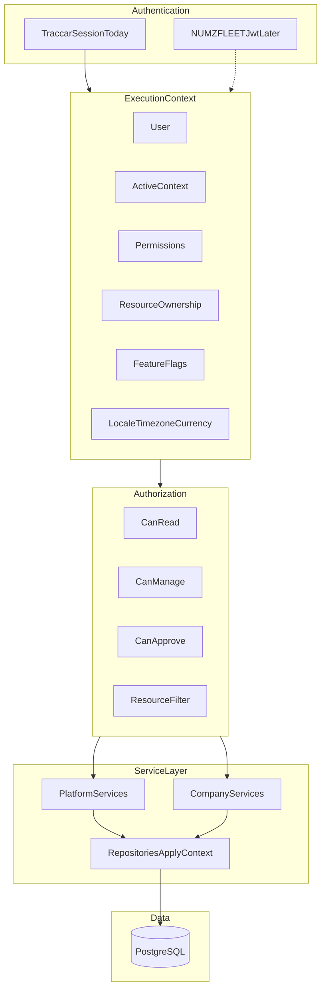

# NUMZ Platform Architecture

**Status:** Frozen v1.0  
**Scope:** Platform identity, tenancy, context, permissions, service boundaries, provisioning, audit, UI modes, auth evolution  
**Does not cover:** Implementation code, API endpoint specs, database migration SQL  
**Applies to:** All work touching authentication, tenancy, company provisioning, platform navigation, or cross-tenant data access  

**Governance:** This document is authoritative. Pull requests that change tenancy, authentication, permissions, provisioning, context switching, or platform navigation must be reviewed against this specification. Deviations require a version bump and amendment here — not silent drift in code.

**Operational supplement:** [fuel-api/docs/ACCOUNTS_AND_TENANCY.md](../fuel-api/docs/ACCOUNTS_AND_TENANCY.md) (request flow, env vars, troubleshooting).

---

## Executive summary

NUMZFLEET is not a fleet application with multi-company support bolted on. It is the **first product** on a shared **NUMZ Platform** that owns tenants (companies), identity, permissions, audit, and licensing.

| Layer | Owner | Question answered |
|-------|-------|-------------------|
| **Authentication** | Traccar today → NUMZFLEET JWT later | Who is logged in? |
| **Execution Context** | fuel-api middleware | Where am I operating? With what permissions and resource scope? |
| **Business data** | PostgreSQL (`company_id`) | Which tenant owns this row? |
| **Telemetry** | Traccar (internal service long-term) | What did the device report? |
| **Company modules** | Fleet, Fuel, Maintenance, Vehicle Engine | What does this data mean for operations? |

**Core rule:** Platform is **not** a company. Platform owns companies. There is no `Company` row for the platform and no `company_type = platform`.

---

## NUMZ Platform positioning

```text
NUMZ Platform
├── Identity
├── Companies
├── Permissions
├── Licensing
├── Audit
├── Notifications
├── AI
│
├── Fleet          ← NUMZFLEET (this repo) today
├── Fuel
├── POS
├── Drive
├── Inventory
├── HR
└── Accounting
```

Every product consumes the same platform services. Products do not implement their own tenancy model.

---

## Architectural stack



---

## Four authorization dimensions

Every access decision answers four questions:

| Dimension | Question | v1 mechanism |
|-----------|----------|--------------|
| **Identity** | Who is logged in? | `numz_users` + Traccar user link |
| **Active Context** | Where am I operating? | Session `activeContext` |
| **Permissions** | What actions may I perform? | `numz_user_roles` + permission bundles |
| **Resource ownership** | Which records may I see? | Assignments + Traccar device ACLs |

### Rules

1. **Roles are permission bundles, not scope.** `super_admin` grants platform permissions; it does not assign a company.
2. **Context is not ownership.** A driver in Company ABC must not see every vehicle in ABC unless permission grants company-wide read.
3. **One question for all modules:** *What is the active context?* — not “is super admin?”, “is impersonating?”, “which company?”.

---

## Active Context

Replace ad-hoc `impersonatedCompanyId`, `isSuperAdmin`, and silent company fallback with a single session concept.

### Platform mode

```json
{
  "userId": 1,
  "homeCompanyId": null,
  "activeContext": {
    "type": "platform",
    "companyId": null
  },
  "permissions": ["platform.companies.read", "platform.companies.manage"]
}
```

Routes: `/platform/*` — companies directory, health, provisioning, support tools.

### Company mode

```json
{
  "userId": 42,
  "homeCompanyId": "abc-uuid",
  "activeContext": {
    "type": "company",
    "companyId": "abc-uuid"
  },
  "permissions": ["vehicles.read", "fuel.approve"]
}
```

Routes: `/vehicles`, Fuel Day, vehicle workspace, company settings.

### Extensibility

Future context types extend `activeContext.type` without redesigning auth:

```text
platform → company → branch → depot → workshop
platform → partner → customer → fleet
```

v1 implements `platform` and `company` only.

### UI modes

| `activeContext.type` | UI | Banner |
|---------------------|-----|--------|
| `platform` | Platform workspace | — |
| `company` | Company workspace | Optional: `Viewing: ABC Logistics [Exit Company]` when entered from platform |

Platform users enter Company Mode only by **explicit context switch**, never by silent fallback.

---

## Context switching invariants (frozen)

1. **Platform → Enter Company:** After switch, `activeContext.type = company`. All Company Services behave **exactly** as if the user belonged to that company — same repository filters, feature flags, and UI. **No hidden bypasses.** No mixed platform+company queries in fleet UI.
2. **Exit Company:** Restore `activeContext.type = platform`. Company-scoped routes redirect to `/platform`.
3. **Platform APIs in platform context only:** `/api/platform/*` rejects requests where `activeContext.type !== platform` (except documented service-to-service paths).
4. **Audit every switch:** `context.entered_company` and `context.exited_company` logged to platform audit.
5. **One active context at a time (v1):** No nested context stack. Future `branch`/`depot` extends the same model.

---

## Execution Context

**Primary name:** `ExecutionContext` — used for HTTP requests, background jobs, schedulers, webhooks, CLI tools, and future AI agents.

**v1 HTTP alias:** `RequestContext` = `ExecutionContext` built from an HTTP `req`. Code may expose `req.context`.

```text
authenticate(req) → resolveExecutionContext(req) → req.context
```

### Fields (v1)

| Field | Purpose |
|-------|---------|
| `user` | Identity (Traccar + `numz_users` link) |
| `activeContext` | Platform or company scope |
| `permissions[]` | Action grants |
| `resourceScope` | Optional filters (assigned vehicle ids, depot ids) |
| `features` | Company feature flags from `companies.settings` |
| `locale`, `timezone`, `currency` | Display and business rules |
| `metadata` | IP, user-agent, correlation id (audit) |

### Repository rules

```text
if activeContext.type === company
  → WHERE company_id = activeContext.companyId
  → apply resourceScope when user lacks company-wide read

if activeContext.type === platform
  → no company filter (platform APIs only)
```

**Frozen:** Controllers never apply `if (superAdmin)`. Repositories apply `ExecutionContext` via a shared helper.

### Transition from today

| Today | Target |
|-------|--------|
| `req.auth` in `tenantContext.js` | `req.context` (`ExecutionContext`) |
| `resolveCompanyContextForTraccarUser()` | `resolveExecutionContext()` |
| `tenantWhere(companyId)` | `ExecutionContext.applySequelizeWhere()` |

---

## Platform vs Company data model

```text
NUMZFLEET Platform
├── Company A
├── Company B
└── Company C
```

**Platform user:** `numz_users.company_id IS NULL`. Never assigned to the default company UUID.

**`DEFAULT_COMPANY_ID`** (`00000000-0000-0000-0000-000000000001`): retained for **historical row backfill** and single-tenant migration only. **Not** the runtime scope for unprovisioned users. Target: provision all humans in `numz_users`; remove silent fallback in `attachTenantContext`.

### Company lifecycle

| State | Meaning |
|-------|---------|
| `draft` | Created, not provisioned |
| `provisioning` | Traccar group, defaults, admin in progress |
| `active` | Normal operation |
| `suspended` | Login disabled, data retained |
| `archived` | Historical only |

### Company settings and feature flags (v1 in JSONB)

Stored in `companies.settings`:

```json
{
  "timezone": "Africa/Lusaka",
  "currency": "ZMW",
  "fuelUnits": "litres",
  "branding": { "logoUrl": null, "primaryColor": null },
  "features": {
    "fleet": true,
    "fuel": true,
    "maintenance": true,
    "expenses": false,
    "erp": false,
    "ai": false
  }
}
```

Peel into `company_settings` / `company_subscription` tables when billing requires querying — not before.

---

## Platform Services vs Company Services

### Platform Services

Operate in `activeContext.type === platform` or cross-tenant with explicit audit. **Must not** be imported by Company Services for tenant filtering.

| Service | Responsibility |
|---------|----------------|
| `CompanyProvisioningService` | Create, provision, suspend companies |
| `PlatformAuditService` | Cross-tenant audit events |
| `CompanyDirectoryService` | List, search companies, summaries |
| `LicenseService` | Feature flags, limits (v1: `companies.settings`) |
| `PlatformHealthService` | Aggregated health for `/platform` |
| `SupportService` | Context switch, support tools (future) |

### Company Services

Always scoped by `activeContext.companyId` in company mode.

| Service | Responsibility |
|---------|----------------|
| Fleet (`vehicleFleetService`) | Vehicle registry, assignments |
| Fuel (operation sessions) | Fuel Day, refuels |
| Maintenance | Schedules, work orders |
| Vehicle Engine | Unified vehicle read model |
| Notifications (company) | Company-scoped alerts |

**Rule:** Company Services receive `ExecutionContext` only. They do not call Platform Services to resolve scope.

---

## Resource ownership

Third filter after company scope.

```text
Driver       → Company ABC → assigned Vehicle 18 only
Technician   → Company ABC → assigned depot/workshop vehicles
Dispatcher   → Company ABC → all vehicles (permission-granted)
```

### v1 mechanisms

- **Map visibility:** Traccar device permissions (existing)
- **Fleet registry:** `device_assignments` + driver links
- **Future:** `resource_grants (user_id, resource_type, resource_id, company_id)`

Repositories apply `company_id` filter **then** `resourceScope` when the user lacks company-wide read permission.

---

## Company Provisioning Engine

Single orchestrator — no scattered controller logic.

```text
CreateCompanyRequest
  → CompanyProvisioningService.provision()
      1. INSERT companies (status = provisioning)
      2. ensureCompanyTraccarGroup()
      3. default settings + feature flags
      4. seed roles / permissions template
      5. create first company admin (numz_users + Traccar user)
      6. emit CompanyProvisioned (domain event)
      7. status → active
```

Rules: idempotent steps, explicit failure/retry states, one transaction where possible.

### Domain events (document now, bus later)

Provisioning must not call every module inline.

| Event | Subscribers (future) |
|-------|---------------------|
| `CompanyCreated` | Audit, directory index |
| `CompanyProvisioned` | Notifications, default fuel config |
| `CompanySuspended` | Auth gate, notification |
| `CompanyContextEntered` | Platform audit |

v1 may use in-process listeners (pattern exists in `fuel-api/src/events/`). Synchronous inline calls are **transitional**.

---

## Platform Health

Minimum indicators for **Platform Mode** (`PlatformHealthService`):

| Indicator | Source | v1 |
|-----------|--------|-----|
| Companies by lifecycle state | `companies` | Yes |
| Active users | `numz_users` | Yes |
| Connected / offline trackers | Traccar + `company_devices` | Yes |
| Traccar connectivity | Traccar `/api/server` probe | Yes |
| Database health | connection pool / `pg_isready` | Yes |
| Processing queues | job metrics | Later |
| Scheduler health | worker heartbeat | Later |
| License / feature usage | `companies.settings.features` + counts | Later |

`/platform` is not only a company list — it is the operator control plane.

---

## Registration and onboarding

| Policy | Rule |
|--------|------|
| Public self-registration | **Disabled** (`RegisterPage` → `/login`) |
| Allowed flow | System owner → Create company → Create first admin → Email invite → Password setup |
| Anonymous company creation | **Forbidden** |

---

## Authentication evolution

| Phase | User experience | Implementation |
|-------|-----------------|----------------|
| **0 (now)** | Login via Traccar | Cookie → `authenticate` → `attachTenantContext` |
| **1** | NUMZFLEET returns full context on login | Extend `POST /api/auth/login` response |
| **2** | Login is NUMZFLEET | JWT from fuel-api; Traccar service account only |

**Frozen:** `authenticate` as strategy pattern (`traccar_session` | `numz_jwt`). Routes do not fork per strategy.

Long-term: users log into NUMZFLEET, not Traccar. Traccar becomes an internal telemetry service. Enables OAuth, MFA, API tokens without Traccar dependency.

---

## Audit strategy

### Today

- `operation_audit_events` — fuel-day domain only
- Console audit in event listeners — not platform-wide

### Target: `platform_audit_events`

| Field | Purpose |
|-------|---------|
| `actor_user_id` | Who |
| `active_context` | Context snapshot at time of action |
| `action` | e.g. `context.entered_company`, `company.provisioned` |
| `resource_type`, `resource_id` | What |
| `payload` | JSON detail |
| `ip`, `occurred_at` | Where, when |

**First events:** context switch, company provision, vehicle delete, fuel approve.

Module-level audit (operation sessions) remains; platform audit is additive.

---

## UI navigation hierarchy

```text
Platform (/platform)
  Health dashboard
  Companies
    Company (explicit context switch)
      Dashboard
      Fleet / Vehicles
        Vehicle workspace
          Fuel | Maintenance | Trips | Documents
      Fuel Operations
      Drivers
      Users and Roles
      Settings
```

Breadcrumbs, permissions, and resource filters derive from `activeContext` + path + `resourceScope`.

### Frontend gap (today)

- [`store/session.js`](../traccar-fleet-system/frontend/src/store/session.js) stores `user` only — no `activeContext` or `permissions`.
- [`useSuperAdmin`](../traccar-fleet-system/frontend/src/common/util/permissions.js) checks Traccar `administrator` flag; backend `isSuperAdmin` requires `administrator` **and** no `numz_users.company_id`. UI and API can disagree until Phase 5 (frontend context store).

---

## NUMZ ecosystem extensibility

Fleet, Fuel, POS, Drive, Inventory, HR, and Accounting share the same platform layer: **Identity, Companies, ExecutionContext, Permissions, Resource ownership, Audit, Licensing, Notifications**.

- **Platform Services** are product-agnostic (provisioning, directory, health, audit).
- **Company Services** are product modules operating under company `activeContext`.
- New products add Company Services; they do not reimplement tenancy.

---

## Data isolation rules

1. Every **new** business table: `company_id NOT NULL` + FK — non-negotiable in code review.
2. Existing tables: covered by `20260616_multi_tenant_foundation.sql` and follow-on migrations.
3. **Traccar isolation:** per-company Traccar group via `company_devices` + `ensureDeviceInCompany` — parallel to Postgres, not a substitute.
4. **Module docs** (e.g. [VEHICLE_ODOMETER_STANDARD.md](VEHICLE_ODOMETER_STANDARD.md)) remain authoritative for domain rules but **consume** `ExecutionContext` for scope.

---

## Governance

1. **`docs/PLATFORM_ARCHITECTURE.md`** is authoritative for platform/tenancy concerns.
2. PRs touching auth, `tenantContext`, `numz_users`, `companies`, provisioning, `/platform` routes, or frontend context routing require explicit check against this spec.
3. Amendments require a **version bump** on this document.
4. Domain standards (odometer M1, operation sessions API, etc.) are not overridden here — they plug into company scope.

---

## Implementation phases (post-freeze)

Do not start until this document is approved.

| Phase | Deliverable |
|-------|-------------|
| 1 | Platform user provisioned (`company_id NULL`, `super_admin`) |
| 2 | `resolveExecutionContext` + `req.context` (parallel to `req.auth`) |
| 3 | `PlatformHealthService` + `/platform` API + UI |
| 4 | `ExecutionContext.applySequelizeWhere` in repositories (vehicles, sessions, fuel first) |
| 5 | Frontend context store + Platform/Company routing + switch banner |
| 6 | Company Provisioning Engine + domain event contracts |
| 7 | Platform audit table + context-switch events |
| 8 | Resource ownership filters (drivers first) |
| 9 | Auth strategy interface + JWT |

---

## Appendix: current implementation gaps

Honest mapping — code that contradicts this spec today:

| Gap | Location |
|-----|----------|
| Silent `DEFAULT_COMPANY_ID` fallback for unprovisioned users | `tenantResolverService.js` |
| `req.auth` not `ExecutionContext` | `tenantContext.js` |
| `listVehiclesMerged(companyId)` — single company only | `vehicleFleetService.js` |
| No `/api/platform/*` routes | — |
| No `activeContext` in frontend session | `store/session.js` |
| `useSuperAdmin` misaligned with backend | `permissions.js` vs `tenantResolverService.js` |
| `companies.status` free string | `Company` model |
| Audit operation-scoped only | `operation_audit_events` |
| No Platform / Company Services package boundary | — |
| No resource ownership layer beyond Traccar ACLs | — |
| No domain events for company provisioning | — |
| No platform health aggregation | — |

These gaps are **expected** until implementation phases begin. New code must move toward the target, not extend legacy patterns.

---

## Related documents

| Document | Role |
|----------|------|
| [fuel-api/docs/ACCOUNTS_AND_TENANCY.md](../fuel-api/docs/ACCOUNTS_AND_TENANCY.md) | Operational: request flow, troubleshooting |
| [fuel-api/docs/DATABASE_MIGRATIONS.md](../fuel-api/docs/DATABASE_MIGRATIONS.md) | Migration apply order |
| [VEHICLE_ODOMETER_STANDARD.md](VEHICLE_ODOMETER_STANDARD.md) | Domain: odometer (company-scoped consumer) |
| [deployment/MIGRATIONS_AND_DEPLOY.md](../deployment/MIGRATIONS_AND_DEPLOY.md) | Deploy + migrate |
