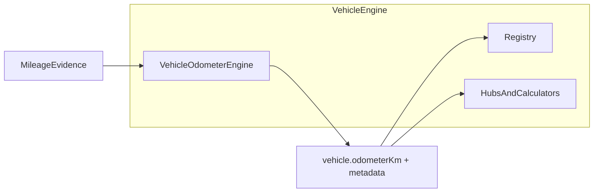

# NUMZFLEET — Vehicle Odometer Engine Specification

**Status:** Milestone 2 — Engine policy (draft)  
**Scope:** How the Vehicle Odometer Engine reaches its decisions  
**Prerequisite:** [VEHICLE_ODOMETER_STANDARD.md](./VEHICLE_ODOMETER_STANDARD.md) (Milestone 1 — frozen business language)  
**Does not cover:** Database schemas, service names, API routes, or frontend (Milestone 3)  

---

## Executive summary

This document answers one question:

> **"How does the Vehicle Odometer Engine decide `vehicle.odometerKm`?"**

It uses only the vocabulary defined in Milestone 1. It does not redefine Evidence, Snapshots, Observations, Confidence, or Drift—it specifies **engine policy** for producing them.

The engine is a **logical component** inside the Vehicle Engine. Every resolution cycle follows the same pipeline:

```
Collect evidence → Validate → Resolve odometer → Score confidence → Calculate drift
```

Policy in this document **may evolve** without changing Milestone 1. Algorithm improvements belong here, not in the business standard.

---

## 1. Relationship to Milestone 1

| Milestone 1 defines… | Milestone 2 defines… |
|----------------------|----------------------|
| What concepts mean | How the engine uses them |
| Who owns the odometer | How ownership is exercised each cycle |
| Drift thresholds (business bands) | Drift calculation procedure |
| Confidence levels (meanings) | Confidence scoring procedure |
| Lifecycle story | Resolution pipeline |

If Milestone 1 and this document conflict, **Milestone 1 wins** on vocabulary and ownership. This document wins on resolution policy.

---

## 2. Engine placement



The Vehicle Odometer Engine runs **before** hub builders and domain calculators consume distance. Maintenance due-by-distance, fuel prefill, and workspace display all read the odometer the engine already resolved—they do not re-resolve.

---

## 3. Resolution pipeline

Each resolution cycle executes these stages in order:

| Stage | Purpose |
|-------|---------|
| **1. Collect** | Gather all available Mileage Evidence for the vehicle |
| **2. Normalise** | Convert evidence to a common unit (kilometres) and attach freshness metadata |
| **3. Validate** | Reject or flag unusable, stale, or suspect evidence |
| **4. Resolve** | Produce exactly one `vehicle.odometerKm` or `null` |
| **5. Score confidence** | Attach confidence level to the estimate |
| **6. Calculate drift** | Compare resolved odometer to latest Observation (if any) |

Stages 5 and 6 never alter the value produced in stage 4.

---

## 4. Evidence collection

### 4.1 Sources gathered each cycle

| Source | Evidence class | Typical freshness |
|--------|----------------|-------------------|
| Latest tracker position | Telemetry | Seconds to minutes |
| Device accumulator | Telemetry | Varies by platform |
| Latest Odometer Observation | Historical (confirmed) | Days to months |
| Prior Odometer Observations | Historical (confirmed) | Archive |
| Recent Odometer Snapshots | Historical (system belief) | Days |
| Secondary signals | Weak fallback | Varies |

Collection is **exhaustive within policy bounds** (e.g. latest observation, last N snapshots, current telemetry). The engine does not wait for modules to pass evidence; it pulls from ingestion stores.

### 4.2 Telemetry attribute priority

When multiple tracker attributes are present on one position, normalise using this **extraction priority** (first usable value wins):

1. `odometer` (if present and numeric)
2. `totalDistance`
3. `mileage`

All extracted telemetry values are treated as **raw evidence** until normalised to kilometres (see Section 5).

### 4.3 Observation ingestion

When a new Odometer Observation is recorded:

1. Store the observation immutably (domain workflow).
2. Update **calibration anchor** internal state: observation km + telemetry snapshot at confirmation time.
3. Future resolution cycles treat the observation as high-trust historical evidence.

Recording an observation does not bypass the engine on the next cycle—it **feeds** the next cycle.

---

## 5. Normalisation

### 5.1 Output unit

All engine internals may use metres for tracker compatibility, but **`vehicle.odometerKm` is always published in kilometres**, rounded to one decimal place maximum.

### 5.2 Telemetry unit detection

Tracker evidence may arrive in mixed units. Normalisation policy:

| Signal pattern | Treatment |
|----------------|-----------|
| `totalDistance` from Traccar accumulator / position | Metres → divide by 1000 for km |
| `odometer` with magnitude consistent with km (fleet context) | Kilometres as-is |
| `odometer` with magnitude consistent with metres | Metres → km |
| Ambiguous magnitude | Flag **unit suspicion**; reduce confidence; prefer Observation anchor if available |

Unit detection rules are engine policy and may be refined without changing Milestone 1.

### 5.3 Freshness

Each evidence item carries:

- `capturedAt` — when the signal was generated or recorded
- `age` — elapsed time since capture at resolution time

Freshness affects **confidence**, not the resolution formula directly, except where policy explicitly prefers fresh telemetry over stale observations (see Section 7).

---

## 6. Validation

Validation filters evidence before resolution. Invalid evidence is excluded or downgraded—it never creates a parallel odometer.

### 6.1 Telemetry validation

| Check | Fail behaviour |
|-------|----------------|
| Missing or non-numeric | Exclude from resolution; contributes to `null` path |
| Negative value | Exclude |
| Device offline beyond threshold | Mark stale; exclude from primary resolution |
| Unit suspicion | Include with warning flag; cap confidence |

### 6.2 Reset detection

A **device reset** is suspected when telemetry cumulative distance **decreases** compared to the telemetry snapshot stored at the last calibration anchor.

Policy when reset is suspected:

- Do **not** allow `vehicle.odometerKm` to decrease below the last defensible position.
- If a calibration anchor exists: apply **anchor + non-negative delta** (delta clamped to zero when telemetry drops).
- Flag reset in engine diagnostics; reduce confidence until a new Observation aligns trust.

### 6.3 Impossible movement detection

**Impossible movement** is suspected when implied speed between two telemetry samples exceeds a configured physical maximum (engine parameter, not business standard).

Policy:

- Do not apply the suspect delta to the odometer.
- Reduce confidence.
- Prefer calibration anchor + bounded delta, or last stable resolution, until evidence stabilises.

### 6.4 Snapshot and observation validation

| Check | Policy |
|-------|--------|
| Snapshot without linked event | Exclude as orphan |
| Observation with non-finite km | Exclude |
| Observation older than retention window | Available for audit; may be excluded from active resolution weighting |

---

## 7. Resolution

Resolution produces **exactly one** `vehicle.odometerKm` or `null`.

### 7.1 Resolution modes

The engine operates in one of three modes per cycle:

| Mode | Condition | Resolution policy |
|------|-----------|-------------------|
| **Anchored** | Calibration anchor exists (from latest Observation + telemetry snapshot at confirmation) | `anchorKm + max(0, currentTelemetryKm − anchorTelemetryKm)` |
| **Telemetry-only** | No anchor; usable telemetry exists | Normalised telemetry km (after validation) |
| **Unavailable** | No anchor and no usable telemetry | `vehicle.odometerKm = null` |

**Anchored mode** is the preferred path when an Observation has established a calibration anchor. This implements the business intent that confirmed dashboard readings ground the estimate while telemetry supplies ongoing delta.

### 7.2 Evidence priority (resolution tie-breaking)

When multiple evidence streams could influence resolution, apply this **priority order**:

1. **Anchored resolution** (Observation-established anchor + validated telemetry delta)
2. **Fresh validated telemetry** (within freshness threshold)
3. **Recent Odometer Observation** (re-anchor implicitly if telemetry absent—engine may hold last anchored value)
4. **Recent Odometer Snapshots** (weak fallback only; never preferred over fresh telemetry when telemetry is valid)
5. **Secondary signals** (last resort)

This priority is **engine policy**. It may change in future versions (e.g. weighting fresh telemetry above an old observation) without amending Milestone 1.

### 7.3 Non-regression rule

`vehicle.odometerKm` must **never decrease** as a result of device reset or bad telemetry when a calibration anchor or prior resolution establishes a higher defensible floor.

Corrections downward require a new **Odometer Observation** that explicitly records a lower confirmed dashboard reading (e.g. odometer replacement, cluster swap)—handled as a new anchor, not silent regression.

### 7.4 Null resolution

Return `null` when:

- No tracker assigned and no historical anchor
- All telemetry fails validation and no anchor exists
- Insufficient evidence to publish a defensible estimate

`null` is a valid outcome. Confidence is **Unavailable**.

---

## 8. Calibration anchor (internal state)

Milestone 1 does not expose "verified odometer" as a business concept. The engine maintains **calibration anchor** as internal state:

| Field (conceptual) | Meaning |
|--------------------|---------|
| `anchorKm` | Odometer km from the Observation that established the anchor |
| `anchorTelemetryKm` | Normalised telemetry km at observation time |
| `anchoredAt` | When the anchor was set |
| `anchorSource` | Observation origin (manual, service, fuel, CAN Bus, etc.) |

**When anchor is set:**

- New Odometer Observation recorded through any sanctioned workflow
- Explicit manager alignment action equivalent to an Observation

**When anchor is updated:**

- New Observation supersedes prior anchor (most recent observation wins)

**When anchor is not set:**

- Engine uses telemetry-only or unavailable mode

Calibration anchor is engine persistence—not a product object operators browse as "verified vs computed."

---

## 9. Confidence calculation

Confidence is computed **after** resolution. It never changes `vehicle.odometerKm`.

### 9.1 Inputs to confidence scoring

| Factor | Effect on confidence |
|--------|----------------------|
| Resolution mode Anchored + fresh telemetry | Increases |
| Resolution mode Telemetry-only | Neutral to moderate |
| Resolution mode Unavailable | Unavailable |
| Recent Observation within drift **Excellent** or **Normal** band | Increases |
| Drift in **Warning** band | Decreases to Medium |
| Drift **Observation Recommended** | Decreases to Low |
| No Observation on record | Caps at Medium (cannot reach High without Observation history) |
| Reset suspected | Decreases |
| Impossible movement suspected | Decreases |
| Telemetry stale (offline beyond threshold) | Decreases |
| Unit suspicion | Decreases |

### 9.2 Confidence assignment procedure

1. Start from base score determined by resolution mode.
2. Apply drift band adjustment (if drift defined).
3. Apply diagnostic penalties (reset, impossible movement, stale, unit suspicion).
4. Apply observation presence cap (no observation → max Medium).
5. Map numeric score to business level: **High**, **Medium**, **Low**, or **Unavailable**.

Threshold mapping is engine configuration. Business meanings of levels are fixed in Milestone 1.

### 9.3 Illustrative outcomes

| Situation | Typical confidence |
|-----------|-------------------|
| Anchored, fresh telemetry, drift Excellent | High |
| Anchored, telemetry ageing, drift Normal | Medium–High |
| Telemetry-only, no observations ever | Medium |
| Reset flagged, no recent observation | Low |
| Resolution returned null | Unavailable |

Illustrative tables are policy guidance, not guarantees for every edge case.

---

## 10. Drift calculation

Drift implementation follows Milestone 1 definition exactly.

### 10.1 Procedure

1. If `vehicle.odometerKm` is `null` → drift **undefined**.
2. If no Odometer Observation exists → drift **undefined** (Snapshots do not count).
3. Let `latestObservationKm` = km from most recent Observation.
4. Compute:

```
driftPct = |vehicle.odometerKm − latestObservationKm| / latestObservationKm × 100
```

5. Classify using Milestone 1 thresholds:

| driftPct | Classification |
|----------|----------------|
| ≤ 0.1% | Excellent |
| > 0.1% and ≤ 0.5% | Normal |
| > 0.5% and ≤ 1.0% | Warning |
| > 1.0% | Observation Recommended |

### 10.2 Drift and resolution interaction

Drift is **diagnostic**. It does not automatically:

- Change `vehicle.odometerKm`
- Create Observations
- Re-anchor calibration

Drift influences **confidence** and may trigger **workflow recommendations** (prompt for observation). Re-alignment after material drift requires a new Observation through domain workflows.

---

## 11. Fallbacks

Fallback policy when primary evidence is missing:

| Condition | Fallback order |
|-----------|----------------|
| Telemetry unavailable, anchor exists | Hold anchored value; confidence reduced; age anchor |
| Telemetry unavailable, no anchor | Try latest Observation km as static estimate (confidence Low) or `null` |
| Telemetry available but invalid | Anchor + clamped delta if anchored; else `null` |
| All sources fail | `null` |

**Snapshots as fallbacks:** Recent Snapshots may inform a weak static estimate only when telemetry and anchor are both absent. Snapshots must not override fresh validated telemetry.

**Secondary signals:** Last-refuel stored mileage and similar weak signals are lowest priority—used only to avoid `null` in non-critical prefill contexts, with confidence Low and explicit engine diagnostic.

---

## 12. Engine outputs

Each resolution cycle publishes:

| Output | Type | Notes |
|--------|------|-------|
| `vehicle.odometerKm` | number \| null | Sole live odometer |
| `confidence` | High \| Medium \| Low \| Unavailable | Per Milestone 1 |
| `driftPct` | number \| undefined | Undefined when no Observation |
| `driftClassification` | Excellent \| Normal \| Warning \| ObservationRecommended \| undefined | Per Milestone 1 bands |
| `resolutionMode` | anchored \| telemetry_only \| unavailable | Internal diagnostic exposed to managers if needed |
| `diagnostics` | flags[] | reset_suspected, impossible_movement, stale_telemetry, unit_suspicion, etc. |

Diagnostics support operations and debugging. They must not surface as alternate odometer values.

---

## 13. Observation and Snapshot side effects

The engine does **not** create Snapshots or Observations. Domain modules do.

| Event | Engine role |
|-------|-------------|
| Business event closes with mileage | Domain creates Snapshot; engine not involved in write |
| Human confirms dashboard | Domain creates Observation; engine updates calibration anchor on next ingest |
| Service complete with odometer | If confirmation occurred → Observation + anchor update |

After any Observation is ingested, the **next resolution cycle** applies anchored mode.

---

## 14. Policies excluded from this engine

These remain in domain modules even though they use `vehicle.odometerKm`:

| Concern | Owner |
|---------|-------|
| Maintenance schedule due (`remaining km`) | Maintenance calculator (reads odometer) |
| Fuel efficiency interval distance | Fuel analytics (reads snapshot pairs) |
| Trip period distance | Reports / Traccar trips |
| Monotonicity validation on fuel capture | Fuel operations (business rule on user input) |
| Traccar schedule `start` in metres | Maintenance bridge (unit conversion at platform boundary) |

---

## 15. Policy evolution

This specification is **versioned independently** of Milestone 1.

Examples of changes that belong here only:

- Reordering evidence priority (e.g. fresh telemetry vs old observation)
- Tightening impossible-movement thresholds
- Adding CAN Bus trust weighting
- Refining confidence score mapping

Examples of changes that require Milestone 1 amendment:

- New business concept (e.g. a third capture type)
- Changing drift threshold percentages
- Redefining what an Observation is

---

## 16. Compliance checklist (engine changes)

Before modifying engine policy, confirm:

1. Still produces exactly one `vehicle.odometerKm` or `null`.
2. Confidence and drift still do not alter the odometer value.
3. Drift still uses latest Observation only—not Snapshots.
4. No new business concept introduced without Milestone 1 update.
5. Domain modules still do not compute parallel live odometers.
6. Milestone 1 glossary terms used consistently.

---

## 17. Related documents

| Document | Role |
|----------|------|
| [VEHICLE_ODOMETER_STANDARD.md](./VEHICLE_ODOMETER_STANDARD.md) | Milestone 1 — business language (frozen) |
| This document | Milestone 2 — engine policy |
| Milestone 3 (planned) | Implementation — database, services, API, migration |
| [fuel-api/src/vehicleEngine/CONTRACT.md](../fuel-api/src/vehicleEngine/CONTRACT.md) | Vehicle Engine governance (integration point) |

---

*End of Vehicle Odometer Engine Specification — Milestone 2*
