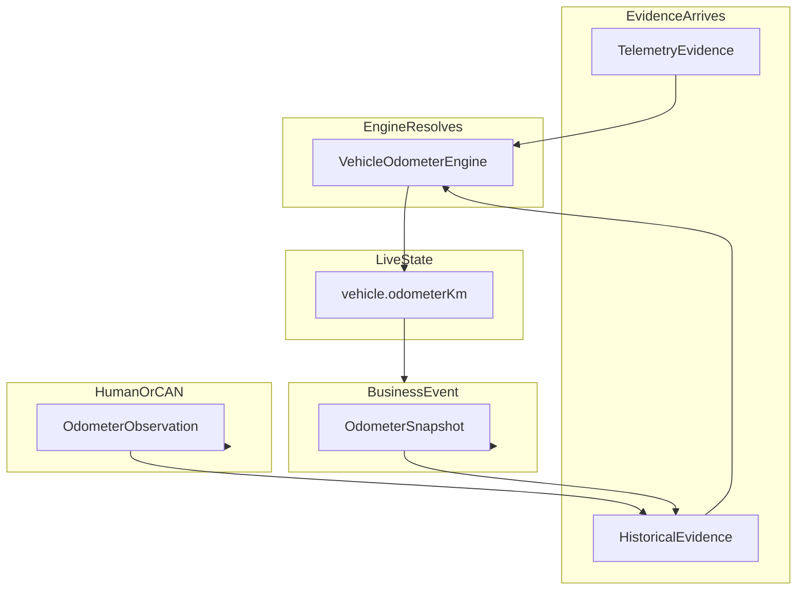
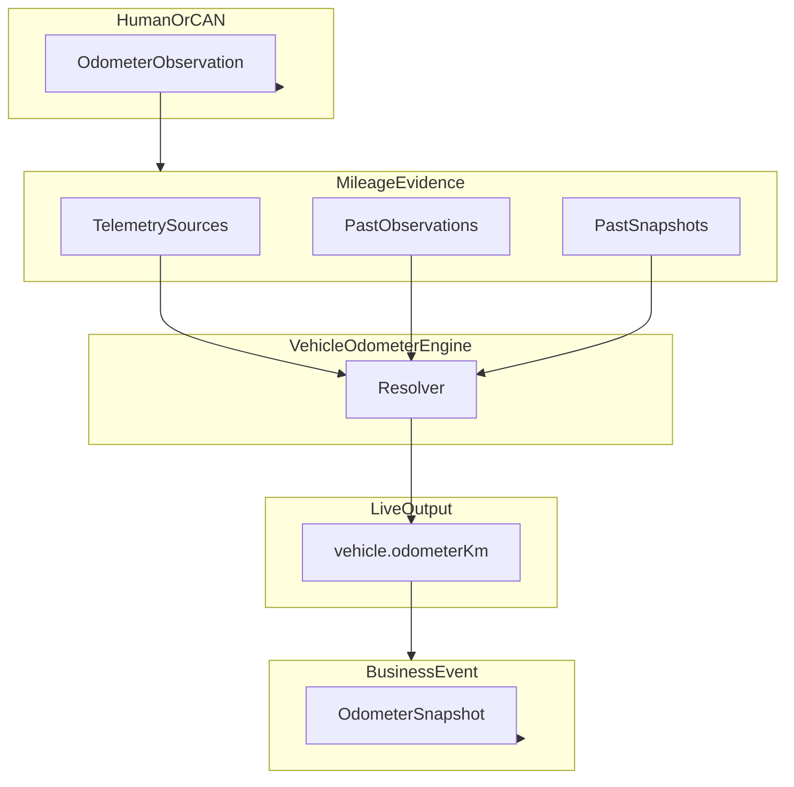

# NUMZFLEET Architecture Standard — Vehicle Odometer Model

**Status:** Milestone 1 — Business language (frozen)  
**Scope:** Definitions and ownership only — what concepts mean, who owns what  
**Does not cover:** How the Vehicle Odometer Engine reaches its decisions (see Milestone 2)  
**Applies to:** All future implementation work on vehicle distance and odometer-related features  

---

## Executive summary

NUMZFLEET operates one authoritative distance reading per vehicle: the **Vehicle Odometer**, expressed as **`vehicle.odometerKm`**.

GPS trackers, Traccar, fuel-day captures, maintenance schedules, and UI surfaces do not define the odometer. They supply **Mileage Evidence**. When business events occur, NUMZFLEET records **Odometer Snapshots** (what the system believed at that moment). When a person or trusted external source confirms the actual dashboard reading, NUMZFLEET records an **Odometer Observation**. The **Vehicle Odometer Engine** is the sole component authorised to resolve **`vehicle.odometerKm`**.

This document answers one question: **"What do these concepts mean?"**  
It does not answer: **"How does the engine decide?"** — that belongs in the separate **Vehicle Odometer Engine Specification** (Milestone 2).

This standard retires competing product concepts—including Computed Odometer, Verified Odometer, Hero Odometer, Fuel Odometer, and maintenance-specific mileage authorities—and replaces them with a single auditable vocabulary: evidence, snapshots, observations, odometer, confidence, and drift.

---

## Core principle

> **NUMZFLEET owns exactly one business odometer for every vehicle. Everything else is evidence.**

| Actor | Role |
|-------|------|
| GPS device | Reports signals; does not own the odometer |
| Traccar | Stores telemetry; does not own the odometer |
| Maintenance, Fuel, Workspace, Reports | Consume the odometer; do not compute it |
| Vehicle Odometer Engine | Sole owner of the live Vehicle Odometer |

---

## 1. Mileage Evidence

### Definition

**Mileage Evidence** is any automatic or historical signal that *may inform* the Vehicle Odometer but is **never** treated as business truth on its own.

Evidence answers: *"What did the system see or record that might relate to distance?"*  
It does not answer: *"What is the vehicle's odometer right now?"*

Only the Vehicle Odometer Engine may use evidence when resolving **`vehicle.odometerKm`**.

### What counts as evidence

Evidence falls into three categories:

#### A. Telemetry sources (live and near-live)

Signals from connected trackers and telematics platforms, including but not limited to:

- Traccar position attributes such as `totalDistance`, `odometer`, and `mileage`
- Device accumulator counters maintained on the tracker or platform
- Sequenced position reports showing cumulative distance change

Telemetry evidence is **automatic**, **device-originated**, and **subject to device behaviour** (resets, misconfiguration, unit ambiguity, offline gaps).

#### B. Historical captures

Frozen distance-related records from past business activity:

| Type | What it represents |
|------|-------------------|
| **Odometer Snapshots** | What NUMZFLEET believed `vehicle.odometerKm` was at a business event |
| **Odometer Observations** | What was confirmed on the vehicle dashboard at a point in time |

Both are immutable. Neither is the live odometer. Once recorded, either may serve as **Mileage Evidence** for future engine resolution. Different evidence types may carry different trust depending on engine policy (defined in Milestone 2).

#### C. Secondary signals

Other recorded distance-related values (for example, mileage stored on past fuel or service records) that the engine may consider as evidence. These are not authoritative on their own.

### Why evidence is never business truth

1. **Devices can be wrong** — wrong units, resets, swapped hardware, stale last-known values.
2. **Platforms normalise differently** — Traccar accumulators and position attributes may disagree.
3. **Evidence can be absent** — offline trackers, unassigned devices, missing fields.
4. **Snapshots are not confirmations** — a fuel record may store mileage the operator never checked against the dashboard.
5. **Multiple evidence streams conflict** — without a single resolver, modules produce different numbers.

Evidence informs resolution. It does not *become* the odometer until the Vehicle Odometer Engine resolves **`vehicle.odometerKm`**.

### Business rules — Mileage Evidence

| # | Rule |
|---|------|
| E1 | All telemetry and historical distance signals are classified as Mileage Evidence unless explicitly resolved as the Vehicle Odometer by the Vehicle Odometer Engine. |
| E2 | No module, UI surface, report, or integration may present evidence as the authoritative vehicle odometer. |
| E3 | Evidence must be attributable: source type, capture time, and vehicle identity are always known or explicitly marked unknown. |
| E4 | Conflicting evidence does not create multiple odometers; conflict is resolved by the engine, not by parallel module logic. |
| E5 | Odometer Snapshots and Odometer Observations are immutable after capture; neither is live odometer authority. |
| E6 | Snapshots and Observations are distinct evidence types and must not be conflated in product language or workflow design. |
| E7 | The engine evaluates all available evidence; how it evaluates evidence is engine policy (Milestone 2), not business vocabulary. |

---

## 2. Odometer Snapshot

### Definition

An **Odometer Snapshot** is the **Vehicle Odometer value automatically captured by NUMZFLEET** at the moment a business event occurs.

It records: *"What did NUMZFLEET believe the vehicle odometer was at this moment?"*

Snapshots are **system-generated**. They do **not** imply anyone verified the dashboard. They are historical business records—immutable and auditable—but they are **not** evidence that the dashboard was actually read.

### What creates a snapshot

Snapshots are created when NUMZFLEET persists mileage as part of a business event, including:

- Fuel record created or completed
- Service or repair completed
- Inspection saved
- Trip closed
- Work order completed
- Any workflow that stores the current `vehicle.odometerKm` at event time

A snapshot is always tied to a **business event** and the value NUMZFLEET held **at that moment**.

### What is recorded (business level)

Each snapshot captures at minimum:

- Vehicle identity
- Odometer value in kilometres (the system's belief at capture)
- Timestamp of the business event
- Event type (fuel, service, inspection, trip, work order, etc.)
- Linkage to the business record that owns the event

### Properties

| Property | Rule |
|----------|------|
| Origin | System-generated from `vehicle.odometerKm` |
| Verification | None implied — operator may not have looked at the dashboard |
| Mutability | Immutable once recorded; corrections are new events |
| Role | Historical business record; may become Mileage Evidence |
| Product language | Must not be labelled "verified", "observed", or "confirmed" |

### Fuel Day example

1. Fuel Day opens. The operator sees a mileage value from `vehicle.odometerKm`.
2. The operator dispenses fuel and accepts the prefilled value **without checking the dashboard**. NUMZFLEET stores an **Odometer Snapshot only**. No Observation is created.
3. Alternatively, the operator reads the dashboard and **enters or confirms** that reading. NUMZFLEET creates an **Odometer Observation**. The business event still produces an **Odometer Snapshot** at close with the final stored value.

The same pattern applies to service completion: closing a service with system-provided mileage alone yields a Snapshot; a mechanic who explicitly records the dashboard reading creates an Observation (and may still produce a Snapshot on the service record).

### Business rules — Odometer Snapshot

| # | Rule |
|---|------|
| S1 | Snapshots are created automatically from `vehicle.odometerKm` (or the value stored on the event) at business event time. |
| S2 | Snapshots never imply human verification of the dashboard. |
| S3 | Snapshots are immutable; corrections require a new business event or record, not edits to the past. |
| S4 | Snapshots may become Mileage Evidence for future engine resolution. |
| S5 | Accepting a prefilled mileage value without editing or explicit confirmation creates a Snapshot, not an Observation. |
| S6 | Snapshots must not be labelled "verified", "observed", or "confirmed" in product language. |

---

## 3. Odometer Observation

### Definition

An **Odometer Observation** exists **only** when a **human** (or a **trusted external source** such as CAN Bus) **confirms the actual dashboard reading** at a point in time.

It records: *"Someone or something trusted actually looked at (or reported) what the vehicle dashboard showed."*

Observations represent **confirmed dashboard truth**. Snapshots represent **system belief**. They are different concepts and must not be conflated.

Observations replace the retired **Verified Odometer** concept. There is no separate "verified" odometer product object.

### What creates an observation

| Origin | Example |
|--------|---------|
| **Manual assertion** | Manager records or confirms dashboard mileage in vehicle setup |
| **Service / maintenance** | Mechanic records dashboard mileage during service completion |
| **Inspection** | Inspector confirms dashboard reading as part of an inspection |
| **Fuel Day (explicit)** | Operator enters mileage from the dashboard or explicitly confirms after editing the prefill |
| **Audit alignment** | Authorised user affirms "this is the correct dashboard reading now" |
| **Trusted external source** | CAN Bus or equivalent provides a dashboard-equivalent reading accepted by NUMZFLEET policy |

### What does **not** create an observation

| Action | Result |
|--------|--------|
| Operator accepts prefilled mileage unchanged | **Snapshot only** |
| System auto-captures odometer on work order close without a reading entry | **Snapshot only** |
| Fuel record stores mileage copied from telemetry with no confirmation step | **Snapshot only** |
| Any workflow that saves the current system odometer without a confirmation act | **Snapshot only** |

Automatic telemetry, by itself, does **not** create an Odometer Observation.

### Snapshot and Observation on the same event

A single business event may produce:

- **An Odometer Snapshot** — when mileage is captured on the event record.
- **An Odometer Observation** — only when dashboard confirmation occurs as part of that event.

The two are independent. A fuel record may have a Snapshot without an Observation. A service with a mechanic-entered reading may have both.

### What is recorded (business level)

Each observation captures at minimum:

- Vehicle identity
- Confirmed odometer value in kilometres
- Timestamp of confirmation
- Source of confirmation (manual, service, inspection, fuel, audit, CAN Bus, etc.)
- Actor or trusted source that created it (where applicable)
- Optional linkage to a business record (service record, refuel row, etc.)

Observations are **immutable**. Corrections are expressed as **new observations**, not edits to old ones.

### Audit trail

NUMZFLEET maintains two related historical streams:

| Stream | Answers |
|--------|---------|
| **Snapshot timeline** | What did NUMZFLEET believe the odometer was at each business event? |
| **Observation timeline** | When was the dashboard actually confirmed, and to what value? |

Both support operations and compliance. They answer different questions and must remain distinct.

### Business rules — Odometer Observation

| # | Rule |
|---|------|
| O1 | An Odometer Observation is created only by explicit human confirmation or trusted external confirmation—not by automatic system capture. |
| O2 | Observations are immutable once recorded; corrections require a new observation. |
| O3 | Observations are always expressed in kilometres. |
| O4 | An observation records a **confirmed dashboard reading**; it is distinct from an Odometer Snapshot. |
| O5 | The most recent observation is the reference point for **Mileage Drift** (see Section 6). |
| O6 | Observations may become Mileage Evidence for future engine resolution; they do not bypass the Vehicle Odometer Engine. |
| O7 | Domain modules own the **capture** of observations in their workflows; they do not own the **live odometer**. |
| O8 | A single business event may produce both a Snapshot (when mileage is stored) and an Observation (only when dashboard confirmation occurs). |

---

## 4. Vehicle Odometer

### Official business definition

The **Vehicle Odometer** is NUMZFLEET's **single, authoritative, best auditable estimate** of the vehicle's **actual dashboard odometer reading right now**, expressed as **`vehicle.odometerKm`** in kilometres.

It represents operational truth for the fleet: maintenance due-by-distance, fuel capture prefill, vehicle workspace display, and cross-module analytics must all reference this one value.

### Cardinality and access

| Requirement | Standard |
|-------------|----------|
| Count per vehicle | Exactly **one** live Vehicle Odometer |
| Field name | **`vehicle.odometerKm`** |
| Consumer rule | Every module **reads** the same value; none **computes** a parallel live odometer |
| Nullable | Permitted when the engine cannot produce an estimate |

There is no:

- Computed Odometer
- Verified Odometer
- Hero Odometer
- Fuel Odometer

Only **`vehicle.odometerKm`**.

### What the Vehicle Odometer is

- The fleet-wide answer to: *"What does NUMZFLEET believe the dashboard odometer shows right now?"*
- The output of the Vehicle Odometer Engine
- Auditable against evidence, snapshot history, and observation history
- Stable in meaning across every module and UI surface

### What the Vehicle Odometer is not

| Retired concept | Replacement |
|-----------------|-------------|
| Computed Odometer | **Vehicle Odometer** (`vehicle.odometerKm`) |
| Verified Odometer | **Odometer Observation** (historical) + **Vehicle Odometer** (live) |
| Hero Odometer | **Vehicle Odometer** |
| Fuel Odometer | **Vehicle Odometer** at prefill; events produce Snapshots / Observations as appropriate |
| Maintenance mileage | **Vehicle Odometer** consumed by maintenance logic |
| Traccar `totalDistance` as odometer | **Mileage Evidence** |
| Tracker `odometer` / `mileage` as odometer | **Mileage Evidence** |

### Relationship to historical captures

| Stored value | Typical classification |
|--------------|------------------------|
| Fuel-day stored mileage | **Odometer Snapshot** by default; **Observation** only if operator explicitly entered or confirmed dashboard reading |
| Service record mileage | **Snapshot** by default; **Observation** when mechanic explicitly records or confirms dashboard reading |
| Inspection mileage | **Observation** when inspector confirms; otherwise **Snapshot** if system value only |

When a module needs the odometer **now**, it reads **`vehicle.odometerKm`**.  
When a module needs the odometer **then**, it reads the Snapshot or Observation attached to that event.

### Business rules — Vehicle Odometer

| # | Rule |
|---|------|
| V1 | There is exactly one live Vehicle Odometer per vehicle: `vehicle.odometerKm`. |
| V2 | Only the Vehicle Odometer Engine may set or change the live odometer value. |
| V3 | No module may display or persist a competing live odometer under another name. |
| V4 | `vehicle.odometerKm` is always in kilometres or explicitly `null`. |
| V5 | Absence of odometer (`null`) is a valid state; modules must handle unavailability without inventing mileage. |
| V6 | Historical Snapshots and Observations are not live odometer values; they are records of the past. |

---

## 5. Confidence

### Definition

**Confidence** expresses **how much trust NUMZFLEET places in the current `vehicle.odometerKm` estimate**.

Confidence is metadata about the estimate. It answers: *"How sure are we that this number reflects the real dashboard?"*

### Why confidence exists

Fleet decisions depend on distance. Operators need to know not only *what* the odometer reads but *whether to rely on it*—without creating a second odometer value.

### Core rule

> **Confidence does not change `vehicle.odometerKm`.**  
> It only describes trust in that estimate.

### Confidence levels

| Level | Meaning |
|-------|---------|
| **High** | Strong trust; suitable for routine operational use without additional confirmation |
| **Medium** | Usable with awareness; operator confirmation may be appropriate for high-stakes actions |
| **Low** | Weak trust; value should be treated as provisional |
| **Unavailable** | No estimate is published (`vehicle.odometerKm` is `null`) |

How confidence is calculated from evidence, snapshots, and observations is **engine policy** (Milestone 2).

### Business rules — Confidence

| # | Rule |
|---|------|
| C1 | Every non-null `vehicle.odometerKm` carries exactly one confidence level. |
| C2 | Confidence never alters the odometer value. |
| C3 | Modules may adapt **workflow** based on confidence (e.g. prompt for observation); they may not compute a different odometer. |
| C4 | Low confidence is an honest representation of uncertainty—not a system failure. |

---

## 6. Mileage Drift

### Definition

**Mileage Drift** is the **difference between the current Vehicle Odometer and the latest Odometer Observation**, expressed as a **percentage of the observation value**.

Drift measures **alignment** between NUMZFLEET's live estimate and the last **confirmed dashboard reading**.

It is a **diagnostic and operational signal**, not a separate odometer. Product language uses **drift** and **observation**—not "calibration."

### What drift compares

| Compared | Not compared |
|----------|--------------|
| `vehicle.odometerKm` vs **latest Odometer Observation** | Snapshots |
| | Telemetry alone |
| | Historical snapshots |

If no Observation exists, drift is **undefined** (not zero)—even when Snapshots exist.  
If `vehicle.odometerKm` is **null**, drift is **undefined**.

### Business thresholds

| Drift range | Classification | Operational meaning |
|-------------|----------------|---------------------|
| **0.0% – 0.1%** | **Excellent** | Live estimate closely matches last confirmed dashboard reading |
| **0.1% – 0.5%** | **Normal** | Expected variance from timing, rounding, or short telemetry lag |
| **0.5% – 1.0%** | **Warning** | Meaningful separation; review recommended |
| **Above 1.0%** | **Observation Recommended** | Material misalignment; record a new Odometer Observation at next practical opportunity |

Threshold boundaries are inclusive at the lower bound of each band (e.g. exactly 0.1% is **Excellent**; above 0.1% enters **Normal**).

### Why drift matters

1. **Trust without duplicate odometers** — Drift exposes misalignment while preserving a single `vehicle.odometerKm`.
2. **Operational prompting** — "Observation Recommended" drives human confirmation without a "verify odometer" product split.
3. **Snapshot distinction** — Snapshots record what NUMZFLEET believed at events; drift measures alignment with a confirmed dashboard.

Drift does **not** automatically change `vehicle.odometerKm`. A new **Odometer Observation** is the business response when drift warrants human confirmation.

How drift interacts with engine resolution is **engine policy** (Milestone 2).

### Business rules — Mileage Drift

| # | Rule |
|---|------|
| D1 | Drift is defined against the **latest Odometer Observation**, not against Snapshots. |
| D2 | Drift is a percentage comparison; it does not create a second odometer value. |
| D3 | Drift classification follows the fixed thresholds in this standard. |
| D4 | Drift above 1.0% implies **Observation Recommended**; it does not imply automatic odometer replacement. |
| D5 | Drift and confidence are related but distinct concepts. |
| D6 | Product language uses **drift** and **observation**; the term **calibration** is not used in operator-facing or business contracts. |
| D7 | If no Observation exists, drift is undefined regardless of how many Snapshots exist. |

---

## 7. Vehicle Odometer Lifecycle

The lifecycle describes how concepts interact **over time**. It is not an algorithm—it is the story every developer should be able to follow in five minutes.

### Lifecycle stages

| Stage | What happens |
|-------|--------------|
| **1. Evidence arrives** | Telemetry reports, past Snapshots, and past Observations become available as Mileage Evidence. |
| **2. Engine resolves** | The Vehicle Odometer Engine evaluates all evidence and produces **`vehicle.odometerKm`** (and confidence). |
| **3. Vehicle Odometer updates** | Modules read the same live value—workspace, maintenance, fuel prefill, analytics. |
| **4. Business event happens** | Fuel, service, trip, inspection, or work order closes. |
| **5. Snapshot recorded** | NUMZFLEET captures what it believed the odometer was: an **Odometer Snapshot**. |
| **6. Human confirms dashboard** | Optionally, an operator or mechanic confirms the physical dashboard reading. |
| **7. Observation recorded** | An **Odometer Observation** is created—only when confirmation occurs. |
| **8. Future resolution** | The Observation becomes Mileage Evidence for the next engine cycle. The lifecycle repeats. |

### Key lifecycle rules

- Evidence flows **in** to the engine. The odometer flows **out** to the business.
- Snapshots flow **from** the odometer at events **out** to history.
- Observations flow **from** human confirmation **into** future evidence.
- The lifecycle never creates a second live odometer.

---

## 8. Vehicle Odometer Engine (ownership only)

### Definition

The **Vehicle Odometer Engine** is the sole subsystem authorised to resolve **`vehicle.odometerKm`**.

It is a logical component within the broader Vehicle Engine. It is not a user-facing product module.

### What it does (business level)

| Responsibility | Description |
|----------------|-------------|
| **Consumes** | Mileage Evidence (telemetry, Snapshots, Observations) |
| **Produces** | `vehicle.odometerKm`, confidence, and drift metadata |
| **Owns** | The live Vehicle Odometer—no other module may compete |

The engine evaluates all available evidence. **How** it evaluates evidence—priority, weighting, validation, reset handling, fallbacks—is defined in the **Vehicle Odometer Engine Specification** (Milestone 2), not in this document.

### What it does not do

| Out of scope | Owned by |
|--------------|----------|
| Maintenance schedule due calculations | Maintenance domain |
| Fuel efficiency and interval distance | Fuel / Analytics |
| UI rendering | Frontend modules |
| Creating Snapshots or Observations | Domain workflow modules |
| Trip distance reporting | Reports / Trips |

---

## 9. Concept ownership summary

| Concept | Owner | Role |
|---------|-------|------|
| Mileage Evidence | Ingestion / telemetry / history | Input to engine; never authoritative alone |
| Odometer Snapshot | Domain events (system capture) | Historical record of system belief |
| Odometer Observation | Human / CAN confirmation | Confirmed dashboard reading |
| Vehicle Odometer Engine | Vehicle Engine | Sole resolver of `vehicle.odometerKm` |
| Vehicle Odometer | Engine output | One live odometer for all modules |
| Confidence / Drift | Engine metadata | Trust signals; do not change the value |

---

## 10. Glossary

| Term | Definition |
|------|------------|
| **Mileage Evidence** | Any signal that may inform the odometer; never authoritative alone |
| **Odometer Snapshot** | System-captured `vehicle.odometerKm` at business event time; no dashboard verification implied |
| **Odometer Observation** | Human- or CAN-confirmed dashboard reading at a point in time |
| **Vehicle Odometer** | `vehicle.odometerKm` — the one business odometer |
| **Vehicle Odometer Engine** | Sole resolver of `vehicle.odometerKm` |
| **Confidence** | Trust in the current estimate; does not change the value |
| **Mileage Drift** | Percent gap between live odometer and latest Observation (not Snapshot) |
| **Vehicle Odometer Lifecycle** | How evidence, resolution, snapshots, and observations interact over time |

---

## 11. Compliance statement

Any future feature touching distance or mileage must be traceable to this standard:

1. Does it **read** `vehicle.odometerKm`, or incorrectly **produce** its own live odometer?
2. Does it treat telemetry as **evidence** rather than truth?
3. Does the workflow create a **Snapshot**, an **Observation**, or **both**?
4. Are Snapshots and Observations **never conflated** in language or behaviour?
5. Does it respect **confidence** and **drift** without splitting the odometer?

---

## 12. Related documents

| Milestone | Document | Scope |
|-----------|----------|-------|
| **Milestone 1** | [VEHICLE_ODOMETER_STANDARD.md](./VEHICLE_ODOMETER_STANDARD.md) (this document) | Business language and ownership |
| **Milestone 2** | [VEHICLE_ODOMETER_ENGINE_SPEC.md](./VEHICLE_ODOMETER_ENGINE_SPEC.md) | Resolution, priority, weighting, validation, confidence calculation, drift calculation, reset detection, fallbacks |
| **Milestone 3** | Implementation guides (planned) | Database, services, API, frontend, migration |

---

*End of Vehicle Odometer Standard — Milestone 1 (frozen)*
