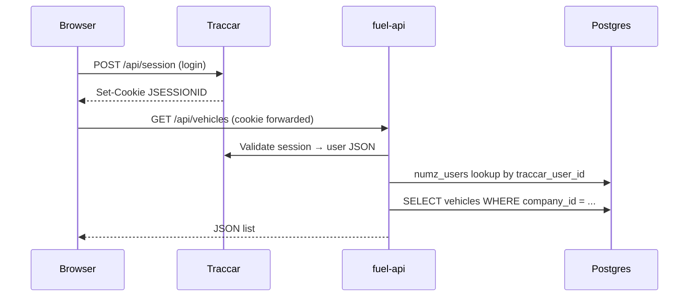

# Accounts and tenancy (NumzTrak / NUMZFLEET)

> **Architecture authority:** [docs/PLATFORM_ARCHITECTURE.md](../../docs/PLATFORM_ARCHITECTURE.md) (frozen v1.0) defines platform vs company scope, Execution Context, permissions, provisioning, and governance. This file is the **operational supplement** — request flow, env vars, and troubleshooting.

How identity, authorization, and data isolation work across Traccar, fuel-api, and the frontend **today** (transitional implementation).

## Two databases, two jobs

| Store | Engine | Holds |
|-------|--------|--------|
| **Traccar MySQL** | `traccar-mysql` | GPS devices, positions, users, groups, drivers, permissions |
| **fuel-api Postgres** | `db` / `numztrak_fuel` | Fleet vehicles, fuel requests, operation sessions, notifications, companies |

Traccar answers: *who is logged in* and *which trackers they can see on the map*.  
fuel-api answers: *fleet business records* (vehicles registry, fuel ops, maintenance) scoped by **company**.

## Request flow (every fuel-api call)



### Step 1 — Authentication (`authenticate` middleware)

- Reads **Traccar session cookie** (`JSESSIONID`) or dev helpers (`x-user-id` when `DEV_AUTH_BYPASS` / hybrid strategy).
- Validates against Traccar `/api/session` (or configured strategy).
- Sets `req.user` = Traccar user object (`id`, `email`, `administrator`, `isManager`, `attributes`, …).
- **No company yet** — only “who is this Traccar user?”

Relevant: `fuel-api/src/middleware/auth.js`, `sessionService.js`, `AUTHENTICATION_STRATEGY.md`.

### Step 2 — Tenant context (`attachTenantContext` middleware)

Runs on fleet routes (`/api/vehicles`, fuel requests, operation sessions, notifications, …).

Calls `resolveCompanyContextForTraccarUser(req.user)`:

1. Look up **`numz_users`** where `traccar_user_id = req.user.id` and `status = active`.
2. If found → `companyId = numz_users.company_id`.
3. If not found → **`DEFAULT_COMPANY_ID`** = `00000000-0000-0000-0000-000000000001` (“Default Fleet”). **Legacy transitional behavior** — target architecture uses explicit `numz_users` provisioning; platform users have `company_id NULL`. See [PLATFORM_ARCHITECTURE.md](../../docs/PLATFORM_ARCHITECTURE.md).
4. Derive **roles** from Traccar flags + optional `user.attributes.numzRole`:
   - `administrator` without company → `super_admin`
   - `administrator` or `isManager` → `company_admin`, `fleet_manager`
   - `attributes.numzRole === 'technician'` → `technician`
   - `attributes.numzRole === 'dispatcher'` → `dispatcher`
   - otherwise → `driver`

Sets `req.auth`:

```js
{
  userId,           // Traccar user id
  companyId,        // UUID — tenant scope for Postgres queries
  numzUserId,       // null until provisioned
  roles,            // string[]
  isSuperAdmin,
  traccarUserId,
}
```

Relevant: `tenantContext.js`, `tenantResolverService.js`.

### Step 3 — Authorization gates (`authGates.js`)

Separate from tenancy — checks **capabilities**:

| Gate | Meaning |
|------|---------|
| `requireAuth` | Must have `req.user` |
| `requireManager` | Traccar manager or administrator |
| `requireRealAuth` | No synthetic/dev bypass user |
| `requireAdmin` | Administrator |

Example: `GET /api/vehicles` = `authenticate` → `attachTenantContext` → `requireAuth` → `requireManager`.

### Step 4 — Data scope

Services filter Postgres rows by `req.auth.companyId`:

- `listVehiclesMerged(companyId)` → `WHERE company_id = companyId`
- Fuel requests, operation sessions, notifications — same pattern via `tenantWhere()` / `resolveCompanyId()`.

Cross-tenant access returns 404 or empty, not another company’s data.

## Postgres tenancy schema

Migration: `migrations/20260616_multi_tenant_foundation.sql`

| Table | Purpose |
|-------|---------|
| `companies` | Tenant record; default row “Default Fleet” |
| `numz_users` | Optional bridge: email ↔ Traccar user ↔ company |
| `numz_user_roles` | App roles per numz user (future) |
| `company_devices` | Maps Traccar device id → company (+ optional vehicle id) |

**Business tables** gain `company_id` (UUID FK to `companies`):

- `vehicles`, `fuel_requests`, `operation_sessions`, `operation_session_refuels`, `vehicle_immobilization_intents`, `notifications`

Existing rows are backfilled to the default company on migration.

## Traccar vs company (important)

Today most installs run in **single-company mode**:

- Everyone without a `numz_users` row shares **Default Fleet** in Postgres.
- **Device visibility on the live map** still comes from **Traccar permissions** (user ↔ device links in MySQL).
- **Fleet vehicle registry** (`/api/vehicles`) is scoped by `company_id` in Postgres.

When you onboard **Company B**:

1. Insert `companies` row.
2. Provision `numz_users` for that company’s staff (link `traccar_user_id`).
3. Assign devices via `company_devices` + Traccar group (`ensureDeviceInCompany` creates/uses a Traccar group per company).

Relevant: `companyProvisioningService.js`.

## Login paths

### Production (today)

1. User logs in on the **frontend** → Traccar `POST /api/session`.
2. Browser stores `JSESSIONID`; Vite/nginx proxies `/api/traccar/*` and fuel-api receives the cookie.
3. Optional: `POST /api/auth/login` (NumzTrak bridge) — validates Traccar, returns `{ user, tenant: { companyId, roles } }` for UI; **NumzTrak-only passwords are not enabled yet** if `numz_users.password_hash` is set.

### Development

- `AUTH_STRATEGY=hybrid`, `DEV_AUTH_BYPASS=true` (see `backend/.env`) allows header-based user id for API testing without a full cookie path.

## Frontend implications

| UI area | Auth source | Data source |
|---------|-------------|-------------|
| Live map, device list | Traccar session | Traccar WS + `/api/positions` |
| Fleet vehicles registry | Traccar session (manager) | fuel-api `/api/vehicles` (company-scoped) |
| Fuel operations | Traccar session | fuel-api operation sessions |
| Notifications | Traccar session | fuel-api notifications (company-scoped) |

Vehicle **display names** on the map merge fuel-api registry + Traccar device names via `VehicleDisplayRegistryContext`.

## Common errors

| Error | Cause | Fix |
|-------|-------|-----|
| `column "company_id" does not exist` | Migration `20260616` not applied | `POSTGRES_CONTAINER=numzfleet-dev-db bash deployment/utils/run-fuel-migrations.sh` |
| `Authentication required` | No Traccar session | Log in again |
| `Access denied` (manager) | User is not manager/admin | Traccar user permissions |
| `Vehicle not found` | Wrong company or no row | Check `vehicles.company_id` vs `req.auth.companyId` |
| Empty fleet list | No vehicles in that company | Create vehicle or check tenant fallback |

## Operational checklist

**Local dev after pulling tenant code:**

```bash
./scripts/dev   # ensure the dev stack (including db) is up
POSTGRES_CONTAINER=numzfleet-dev-db bash deployment/utils/run-fuel-migrations.sh
# restart backend if already running: docker restart numzfleet-dev-fuel-api
```

**Production deploy:**

```bash
./deployment/run-migrate-and-deploy.sh <full-git-sha>
```

(Migrate list includes `20260616_multi_tenant_foundation.sql` as of the tenant foundation release.)

## Future direction

Target state is defined in [PLATFORM_ARCHITECTURE.md](../../docs/PLATFORM_ARCHITECTURE.md). Summary of what is **not yet implemented**:

- `ExecutionContext` / `activeContext` (replacing `req.auth` + silent fallback)
- Platform Services vs Company Services boundary
- `/platform` workspace and Platform Health
- NumzTrak-native JWT login
- Strict Traccar group isolation per company
- Resource ownership layer beyond Traccar device ACLs
- `numz_user_roles` enforcement (not only inferred Traccar flags)

Until provisioning is complete, legacy installs may still use **Default Fleet** as the data backfill tenant. Traccar remains the source of truth for **who sees which devices on the map**.
